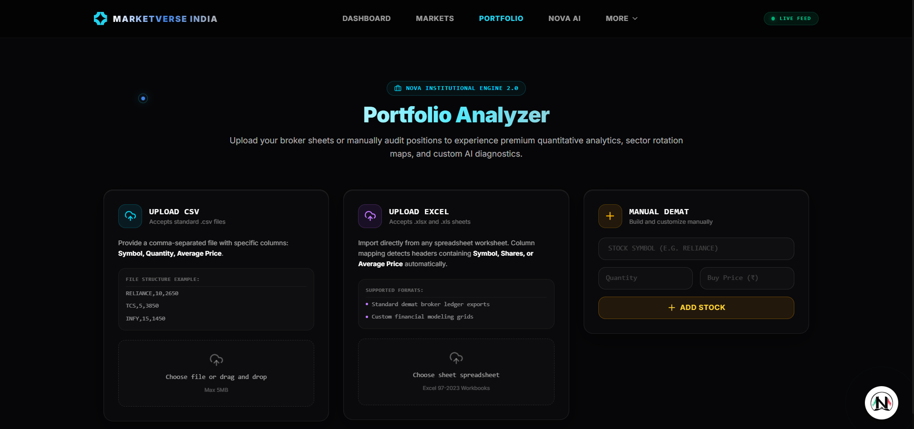
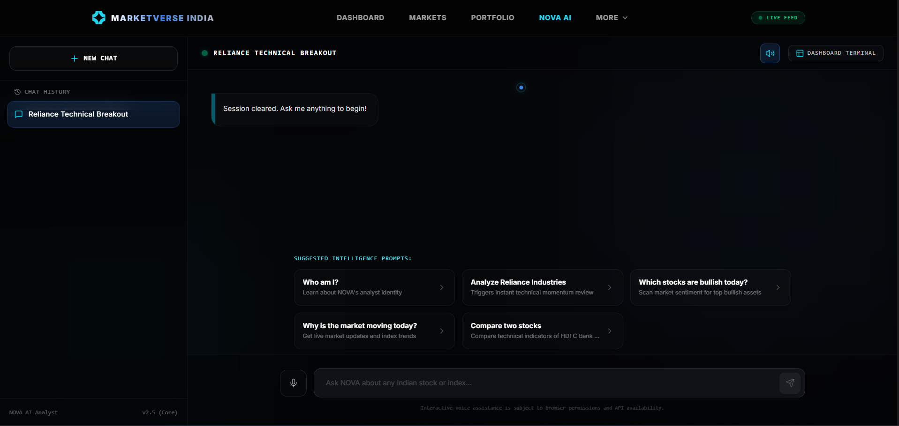
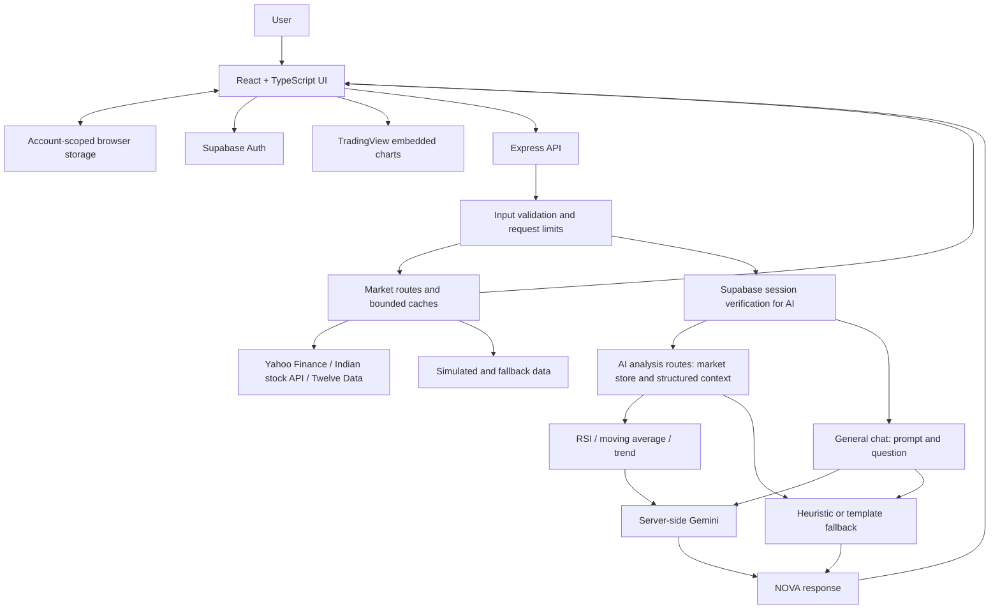

<div align="center">
  

# MarketVerse India

**Indian market intelligence, portfolio context, and AI-assisted exploration—in one trading simulation workspace.**

Understand markets. Analyze context. Trade with discipline.


[](LICENSE)

[**Live demo ↗**](https://market-verse.vercel.app) · [Architecture](#architecture) · [Features](#key-features) · [Getting started](#local-development)

</div>

> **Demo access:** Authentication on the current public deployment is intentionally restricted to the project owner's authorized account. External visitors are not currently provided account access. This is a demo-access limitation; an unsuccessful sign-in does not by itself indicate a broken login system. Explore the public landing page, screenshots, and architecture below.

## Product preview


| Portfolio workspace | NOVA AI workspace |
| :---: | :---: |
| [](docs/images/portfolio-analyzer.png) | [](docs/images/nova-ai.png) |
| Import holdings and explore portfolio context | Ask market questions in a dedicated copilot interface |

*Actual project screenshots supplied by the owner. These are interface previews, not evidence of current prices or live feeds. The portfolio capture predates import hardening: the current limit is 2 MB and 100 holdings, despite the older label shown. [Capture notes](docs/SCREENSHOTS.md).*

## Why MarketVerse exists

**The problem isn't lack of information. It's fragmented information and lack of context.** Quotes, charts, headlines, and portfolio exposure often sit in separate tools. Reading more does not necessarily make the relationship between a market move and a portfolio clearer.

MarketVerse brings those views together: explore Indian equities, inspect technical signals, review holdings, ask contextual questions, and practice with virtual capital. The project separates code-based calculations and structured market context from generative explanation, while retaining demo paths when external services are unavailable.

## Key features

| Workspace | What is implemented |
| --- | --- |
| **Dashboard** | Configurable market widgets, sector heatmaps, watchlist and portfolio views. |
| **Indian Market Hub** | Equity and benchmark browsing, symbol search, stock details, charts, and provider-backed or fallback quotes. |
| **Bullish / Bearish Radar** | Rule-based ranking using price change, RSI, moving-average position, and MACD-related values. Scores are heuristics, not calibrated probabilities. |
| **Portfolio Analyzer** | Manual holdings and CSV/XLS/XLSX import, value and P&L summaries, sector allocation, heuristic health/risk ratings, and hypothetical trade analysis. |
| **Paper trading** | Virtual cash and holdings, simulated buy/sell operations, configurable leverage, and portfolio repricing. Default starting cash is ₹10,00,000. No brokerage execution. |
| **AI News Feed** | Provider news or seeded fallback headlines, with Gemini enrichment for authenticated requests and heuristic sentiment fallbacks. |
| **Quant Academy** | Built-in educational lessons and strategy explanations, presented in the AI Learning Academy interface. |
| **NOVA AI** | Conversational market exploration, stock analysis, comparisons, and educational explanations, with local/server fallback responses. |

Portfolio and trading state are stored in **account-scoped browser storage**, not a Supabase portfolio database. Signed-in state uses local storage; guest state uses session storage. It is device/browser-local and is not a brokerage ledger or cross-device backup.

## NOVA AI

NOVA is the application's market intelligence/copilot interface, powered by **Google Gemini through `@google/genai`**. MarketVerse does not train or host its own foundation model. NOVA is not a financial advisor, and generated text is not an independent source of market facts.

The implementation has distinct paths:

- **Contextual analysis:** `/api/ai/chat` constructs context from the server's market store; `/api/ai/analyze-stock` prepares a quote, generated history, RSI, a moving average, and trend before requesting a Gemini explanation. Some inputs are explicitly simulation data.
- **General chat:** `/api/chat` sends the question with a platform prompt. It does **not** run the same structured market-context pipeline. The client may separately fetch a quote to display a stock card.
- **Fallbacks:** Missing keys, provider failures, and quota limits can yield templated or heuristic responses. Some fallback values are seeded or randomized; an answer appearing on screen does not prove a live inference or a verified market observation.

The server uses `GEMINI_MODEL`, defaulting to `gemini-2.5-flash`. API credentials remain server-side. Treat explanations as material to inspect alongside the underlying data, not as verified forecasts.

## Architecture



Market retrieval and server AI context are separate code paths; this diagram does not imply every AI answer uses a fresh provider quote. Frontend indicators and Radar scoring also run in the browser. External chart widgets have their own data path.

<details>
<summary><strong>Engineering details and current limits</strong></summary>

- **Transport:** HTTP requests with periodic refresh and local simulation updates; no application WebSocket market feed.
- **Indicators:** `src/services/marketApi.ts` computes SMA, RSI, Bollinger Bands, and simplified MACD-related values. Its MACD path uses rolling means rather than a canonical EMA-based implementation. Separate `marketTools.ts` helpers contain EMA-based MACD calculations; those helpers should not be confused with the primary UI calculation path.
- **Risk labels:** Radar and portfolio health ratings use application rules. They are neither machine-learning predictions nor statistically calibrated risk estimates. An HHI calculation is not established by the portfolio implementation, even though some assistant copy mentions it.
- **Deployment:** Development runs Express with Vite middleware. `npm run build` separates browser output in `dist/` from the server bundle in `build/`. Vercel uses `api/index.ts` as the Express entry and the rewrites in `vercel.json`.
- **Scaling:** Current caches, quotas, and concurrency controls are process-local. Multi-instance deployment requires shared or edge enforcement for global limits.

For a compact map from these claims to source, see [implementation notes](docs/IMPLEMENTATION.md).

</details>

## Security and engineering

Recent remediation work keeps provider credentials on the server, explicitly allowlists browser configuration, verifies Supabase sessions before AI requests, validates API inputs, and bounds request bodies, provider calls, caches, and inference concurrency.

Account changes cancel outstanding client requests and guard against stale writes into another account's state. Spreadsheet imports run in a terminable worker with file, row, column, and numeric validation. Browser and server build artifacts are separated. These are implemented safeguards, not a security certification; see [SECURITY.md](SECURITY.md) for responsible reporting.

## Technology stack

Versions below describe the current package declarations, not promises about future upgrades.

| Layer | Technology |
| --- | --- |
| Frontend | React 19, TypeScript 5.8, Vite 6, Tailwind CSS 4 |
| Interface | Recharts 3, Motion 12, Lucide icons, TradingView embeds |
| Backend | Node.js (22+ recommended), Express 4, TypeScript via `tsx` |
| AI | Google Gemini; `@google/genai` 2.x |
| Data / authentication | Market provider adapters; Supabase JS 2.x for authentication |
| Import / analytics | SheetJS 0.20.3; application-defined TypeScript calculations |
| Tooling / deployment | npm lockfile, Node test runner through `tsx`, esbuild, Vercel configuration |

TypeScript is configured without `strict` mode. `npm run lint` runs the TypeScript checker; it is not an ESLint command.

## Project structure

```text
Market-Verse/
├── src/
│   ├── components/       # Workspaces, charts, portfolio, NOVA
│   └── services/         # Market client, indicators, trading, account storage
├── server.ts             # Express routes, AI orchestration, development host
├── server/               # Auth routes, validation, limits, provider safeguards
├── marketProviders/      # Quote and history adapters, simulation fallbacks
├── api/index.ts          # Vercel Express entry
├── shared/               # Public configuration validation
├── tests/                # Security, account isolation, import regression tests
└── docs/                 # Screenshots and implementation notes
```

## Local development

Use Node.js 22+ and npm. Bring your own provider credentials and Supabase project to exercise authenticated features; the restricted public demo does not grant local account access.

```sh
git clone https://github.com/jesvinmmathew-sys/Market-Verse.git
cd Market-Verse
npm ci
```

Copy `.env.example` to `.env` (PowerShell: `Copy-Item .env.example .env`; macOS/Linux: `cp .env.example .env`). Replace the placeholders locally:

| Variable | Purpose |
| --- | --- |
| `GEMINI_API_KEY` | Server-only Gemini access; without it, AI paths use demo/fallback behavior. |
| `GEMINI_MODEL` | Optional model override; example defaults to `gemini-2.5-flash`. |
| `MARKET_API_KEY` | Server-only Twelve Data access; other providers/fallbacks are also used. |
| `VITE_SUPABASE_URL` | Your Supabase project URL, exposed to the browser. |
| `VITE_SUPABASE_PUBLISHABLE_KEY` | Your project's public publishable key. |
| `SUPABASE_URL` | The same project URL for server authentication verification. |
| `SUPABASE_ANON_KEY` | A publishable/legacy anon key for server verification; never a service-role key. |

Do not leave example project values in place and expect login to work. Authentication requires a configured project and valid session; provider keys alone do not unlock AI endpoints. Never prefix provider secrets with `VITE_` or commit `.env`.

```sh
npm run dev
```

Open **http://localhost:3000** for local development. Express serves API routes and Vite middleware together.

| Command | Purpose |
| --- | --- |
| `npm run build` | Build `dist/` and `build/server.cjs`. |
| `npm run lint` | Check TypeScript with `tsc --noEmit`. |
| `npm test` | Run the existing TypeScript tests with Node's test runner. |
| `npm run preview` | Preview the Vite frontend build only; it does not start the Express API. |

There is no production `start` script. The checked-in production wiring targets Vercel; invoking the generated server bundle alone is not a documented standalone listener.

## Demo access and data notice

**Authentication on the current public deployment is intentionally restricted to the project owner's authorized account. External visitors are not currently provided account access.** This describes demo availability, not an application security mechanism. Review the screenshots, source, architecture, and publicly accessible landing experience without signing in.

Market views can contain **delayed, cached, simulated, or fallback/demo data**, depending on provider availability and application state. News can come from seed templates. Generated histories and rule-based analysis can still be displayed when provider calls fail. Interface labels such as “live” do not guarantee exchange-real-time data across the application.

Refer to displayed timestamps and data-status labels where available to understand when information was generated or last updated. A timestamp can describe a generated demo record; it does not certify exchange freshness. Screenshots are historical interface captures, not current market information.

## Project direction

MarketVerse explores how market browsing, portfolio awareness, and conversational explanations can share one workspace. Its current engineering emphasis includes resilient provider handling, bounded AI access, account isolation, and validated portfolio imports.

Potential next steps, rather than shipped capabilities:

- A documented public demo account flow.
- Clearer source/freshness labels and stronger production data integrations.
- Persistent portfolio infrastructure with cross-device recovery.
- Consolidated, independently tested indicator implementations.
- Shared production quotas and a contribution-focused CI workflow.

## Contributing

See [CONTRIBUTING.md](CONTRIBUTING.md). Small, focused improvements to documentation, data provenance, analytics correctness, accessibility, and tests are welcome. Discuss substantial changes in an issue first. Report vulnerabilities privately using [SECURITY.md](SECURITY.md).

## Disclaimer

MarketVerse is an educational, research, and trading-simulation project. It does not provide financial advice, investment recommendations, guaranteed returns, or guaranteed market predictions. Scores and generated explanations should not be treated as buy/sell recommendations or validated prediction probabilities.

## License

[MIT](LICENSE) © 2026 Jesvin M Mathew. Third-party packages, provider data, and embedded services retain their own terms; this license does not grant redistribution rights to their content.
