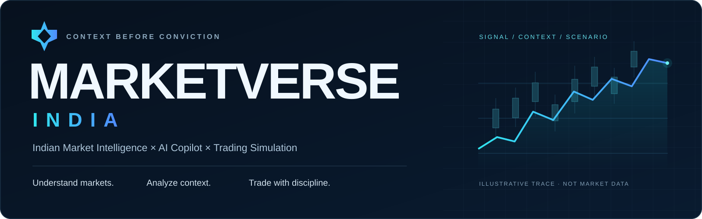
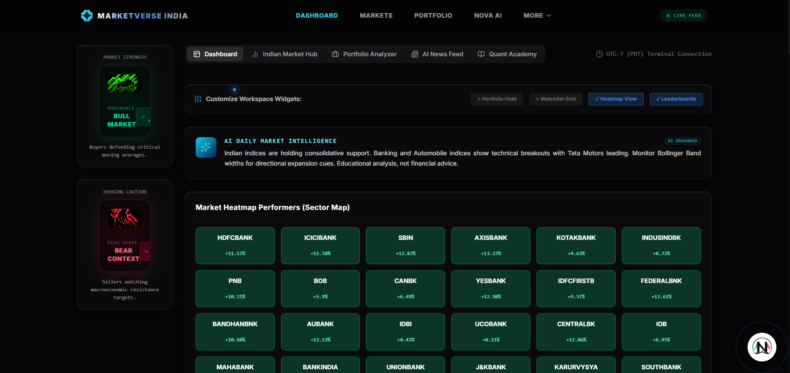
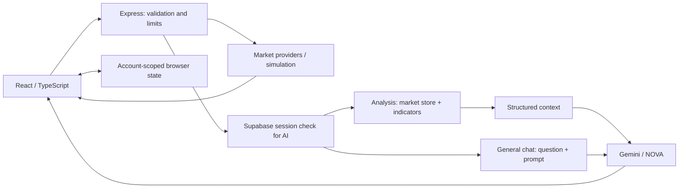

<div align="center">
  

**Market context, portfolio awareness, and AI-assisted exploration. One workspace.**

[](https://market-verse.vercel.app)
[](docs/IMPLEMENTATION.md)
[](#architecture)

</div>

> **Demo access:** Authentication on the current public deployment is intentionally restricted to the project owner's authorized account. External visitors are not currently provided account access. This is a demo limitation—not an indication that login is broken. Explore the public landing page and preview below.

## Product preview



*Real project capture; displayed prices and “live” labels do not establish current market data. [Screenshot and walkthrough brief →](docs/SCREENSHOTS.md)*

## What is MarketVerse?

**The problem isn't lack of information. It's fragmented information and lack of context.**

MarketVerse India brings Indian equities, technical signals, headlines, portfolio exposure, and conversational AI into a trading-simulation environment. Explore a market move, understand its context, and practice with virtual capital.

## Key features

| Explore | Understand | Practice |
| --- | --- | --- |
| **Dashboard & Market Hub** — heatmaps, watchlists, stock search, benchmark and chart views. | **Bullish / Bearish Radar** — rule-based rankings from price change and technical indicators. | **Paper trading** — simulated buy/sell operations, virtual holdings, and configurable leverage. |
| **AI News Feed** — provider or seeded headlines, Gemini enrichment and heuristic fallbacks. | **Portfolio Analyzer** — manual or spreadsheet holdings, P&L, sector allocation, and heuristic health ratings. | **Quant Academy** — built-in market lessons and strategy explanations. |

Default virtual cash: **₹10,00,000**. Holdings are **account-scoped and browser-local**, without cross-device portfolio storage or brokerage execution. Radar and risk scores are heuristics, not calibrated probabilities.

## NOVA AI

**A Gemini-powered conversational market copilot.** NOVA supports market questions, stock analysis, comparisons, and educational explanations.

Supported analysis routes prepare structured market context and code-calculated indicators before generative explanation. General chat uses a separate prompt-and-question path; it does not run the same context pipeline. Inputs may be simulated, and unavailable providers can trigger template or heuristic responses.

MarketVerse does not train its own foundation model. NOVA is not a financial advisor or an independent source of verified market facts. [How NOVA works →](docs/IMPLEMENTATION.md#nova-route-behavior)

## Architecture



Provider retrieval and server AI context are separate paths; not every answer uses a fresh quote. Frontend indicators also run in the browser. [Detailed architecture, safeguards, and limitations →](docs/IMPLEMENTATION.md#detailed-architecture)

## Tech stack

| Interface | Backend & AI | Data & tooling |
| --- | --- | --- |
| React 19 · TypeScript 5.8 | Node.js · Express 4 | Supabase Auth · provider adapters |
| Vite 6 · Tailwind CSS 4 | Gemini via `@google/genai` | SheetJS · Node test runner |
| Recharts · Motion · TradingView | Server-side provider credentials | esbuild · Vercel configuration |

## Quick start

Use **Node.js 22+** and npm:

```sh
git clone https://github.com/jesvinmmathew-sys/Market-Verse.git
cd Market-Verse
npm ci
```

Copy `.env.example` to `.env` (`Copy-Item .env.example .env` in PowerShell; `cp .env.example .env` on macOS/Linux). Replace placeholders with your own Supabase configuration and server-only provider keys, then run `npm run dev` and open **http://localhost:3000** locally. Never commit `.env`.

**Checks:** `npm test` · `npm run lint` (TypeScript check) · `npm run build`.

Authenticated features require your own configured project and valid session. `npm run preview` serves only the frontend, not the API. [Environment variables, build outputs, and setup details →](docs/IMPLEMENTATION.md#full-local-development-setup)

## Demo data and responsible use

MarketVerse may display **delayed, cached, simulated, seeded, or fallback/demo data**, depending on provider availability and application state. Timestamps indicate when displayed or generated information was produced or updated; they do not guarantee exchange freshness.

This is an **educational, research, and trading-simulation project**. It provides no financial advice, investment advisory relationship, buy/sell recommendations, guaranteed returns, or guaranteed predictions. AI output may be inaccurate; users remain responsible for real financial decisions.

## Documentation

[Implementation & roadmap](docs/IMPLEMENTATION.md) · [Contributing](CONTRIBUTING.md) · [Security](SECURITY.md) · [Terms of Use](TERMS.md) · [MIT License](LICENSE)

MIT © 2026 Jesvin M Mathew. Third-party content retains its own terms. The existing website legal copy has unresolved differences with the repository license and data disclosures; see the [publication review notes](docs/LEGAL_REVIEW.md).
