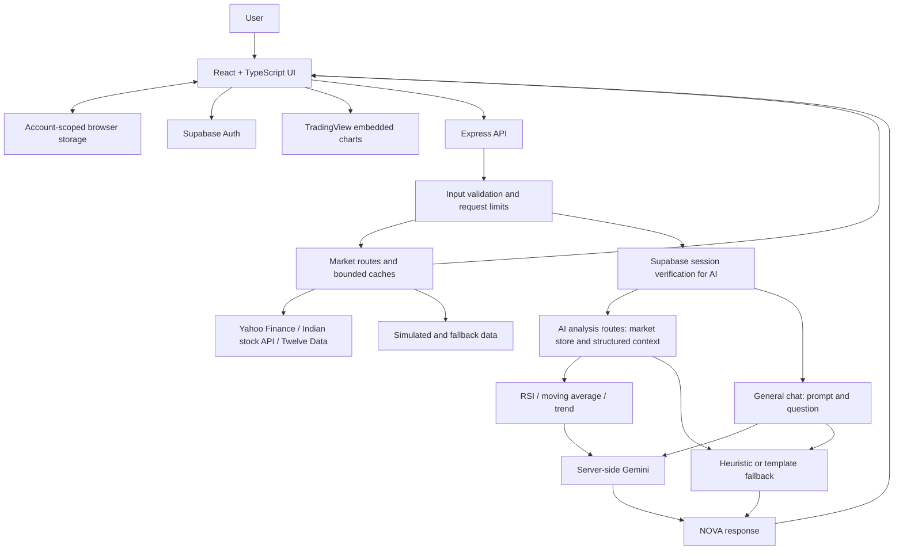

# Implementation notes

These notes map the README to the current implementation. Source behavior takes precedence over interface copy and comments.

| Claim | Source to inspect |
| --- | --- |
| React 19, Vite 6, TypeScript 5.8, Tailwind 4, Express 4, Gemini SDK 2 | [`package.json`](../package.json), with resolved dependencies in `package-lock.json` |
| TypeScript strict mode is not enabled | [`tsconfig.json`](../tsconfig.json) |
| Browser market indicators and simulated history | [`marketApi.ts`](../src/services/marketApi.ts): `calculateTechnicalIndicators`, `generateHistory` |
| Separate EMA-based MACD helpers | [`marketTools.ts`](../src/services/marketTools.ts); distinguish these from `marketApi.ts`'s simplified MACD calculation |
| Rule-based bullish/bearish rankings | [`MarketRadar.tsx`](../src/components/MarketRadar.tsx): scoring based on change, RSI, MACD-related history, moving averages |
| Portfolio metrics and heuristic commentary | [`PortfolioAnalyzer.tsx`](../src/components/PortfolioAnalyzer.tsx); some commentary is built from local templates rather than Gemini |
| Virtual cash and buy/sell state | [`trading.ts`](../src/services/trading.ts); default cash is 1,000,000 INR |
| Browser-local account state and stale-write guards | [`accountStorage.ts`](../src/services/accountStorage.ts), [`AccountBoundary.tsx`](../src/components/AccountBoundary.tsx) |
| Authenticated server AI, context and fallbacks | [`server.ts`](../server.ts), [`access.ts`](../server/lib/access.ts) |
| General chat has a different context path | `/api/chat` in `server.ts`; [`novaAi.ts`](../src/services/novaAi.ts) separately fetches quotes for some stock cards |
| Server-only credentials and model override | `getGeminiClient` in `server.ts`; [`vite.config.ts`](../vite.config.ts) explicitly exports only public Supabase configuration |
| Quote/history providers and fallback generators | [`marketProviders/`](../marketProviders/), market routes in `server.ts` |
| Import validation and worker termination | [`portfolioImport.ts`](../src/services/portfolioImport.ts), [`importPortfolioFile.ts`](../src/services/importPortfolioFile.ts) |
| Validation, bounded calls, process-local limits | [`server/lib/`](../server/lib/) |
| Vercel entry, frontend output and server separation | [`api/index.ts`](../api/index.ts), [`vercel.json`](../vercel.json), build script in `package.json` |
| Existing regression coverage | [`security.test.ts`](../tests/security.test.ts), [`account-import.test.ts`](../tests/account-import.test.ts) |

## Boundaries worth preserving

Deterministic calculations mean that the same inputs produce the same calculation result. They do not establish that the inputs are real market observations. The server analysis routes can calculate indicators from generated history, and multiple fallback paths use fixed, seeded, or randomized values.

The main browser MACD implementation uses rolling means and a simplified signal. The separate helper implementation uses EMA recurrences. Neither the README nor future demos should imply that every displayed indicator has been validated against a reference financial library.

Some legacy UI/assistant language refers to institutional-grade analysis, HHI, live data, or probability. Those words alone do not establish implemented or independently verified capabilities. In particular, the portfolio health calculation uses application rules; it is not evidence of an HHI implementation or a calibrated risk model.

Supabase is used for authentication. The portfolio/trading services persist account-scoped browser state; the repository does not establish a Supabase-backed portfolio database.

## Documentation review baseline

The presentation review examined the remediation series ending at `f28cfa6`: authenticated and bounded AI access (`4a9545d`), server-only provider keys and account isolation (`13cbe2d`), import and artifact hardening (`1ee77c2`), and final validation/provider refinements (`f28cfa6`). This is source review context, not a security audit certification.

The public deployment's owner-only account access is a project-owner-provided operational notice, not an inferred allowlist implemented in this repository. The demo URL is retained from the existing README; deployment uptime and settings are not asserted by this documentation review.

No repository evidence was found for FINVERSE affiliation or an internal Smart India Hackathon selection result. Add recognition only after the owner confirms the institution, event, year, and exact result; distinguish internal selection from a national SIH win.

## Detailed architecture



Market retrieval and server AI context are separate code paths; this diagram does not imply every AI answer uses a fresh provider quote. Frontend indicators and Radar scoring also run in the browser. External chart widgets have their own data path.

<details>
<summary><strong>Engineering details and current limits</strong></summary>

- **Transport:** HTTP requests with periodic refresh and local simulation updates; no application WebSocket market feed.
- **Indicators:** `src/services/marketApi.ts` computes SMA, RSI, Bollinger Bands, and simplified MACD-related values. Its MACD path uses rolling means rather than a canonical EMA-based implementation. Separate `marketTools.ts` helpers contain EMA-based MACD calculations; those helpers should not be confused with the primary UI calculation path.
- **Risk labels:** Radar and portfolio health ratings use application rules. They are neither machine-learning predictions nor statistically calibrated risk estimates. An HHI calculation is not established by the portfolio implementation, even though some assistant copy mentions it.
- **Deployment:** Development runs Express with Vite middleware. `npm run build` separates browser output in `dist/` from the server bundle in `build/`. Vercel uses `api/index.ts` as the Express entry and the rewrites in `vercel.json`.
- **Scaling:** Current caches, quotas, and concurrency controls are process-local. Multi-instance deployment requires shared or edge enforcement for global limits.

For a compact map from these claims to source, see [implementation notes](IMPLEMENTATION.md).

</details>

## Security and engineering

Recent remediation work keeps provider credentials on the server, explicitly allowlists browser configuration, verifies Supabase sessions before AI requests, validates API inputs, and bounds request bodies, provider calls, caches, and inference concurrency.

Account changes cancel outstanding client requests and guard against stale writes into another account's state. Spreadsheet imports run in a terminable worker with file, row, column, and numeric validation. Browser and server build artifacts are separated. These are implemented safeguards, not a security certification; see [SECURITY.md](../SECURITY.md) for responsible reporting.


## Technology stack

Versions below describe the current package declarations, not promises about future upgrades.

| Layer | Technology |
| --- | --- |
| Frontend | React 19, TypeScript 5.8, Vite 6, Tailwind CSS 4 |
| Interface | Recharts 3, Motion 12, Lucide icons, TradingView embeds |
| Backend | Node.js (22+ recommended), Express 4, TypeScript via `tsx` |
| AI | Google Gemini; `@google/genai` 2.x |
| Data / authentication | Market provider adapters; Supabase JS 2.x for authentication |
| Import / analytics | SheetJS 0.20.3; application-defined TypeScript calculations |
| Tooling / deployment | npm lockfile, Node test runner through `tsx`, esbuild, Vercel configuration |

TypeScript is configured without `strict` mode. `npm run lint` runs the TypeScript checker; it is not an ESLint command.


## Project structure

```text
Market-Verse/
├── src/
│   ├── components/       # Workspaces, charts, portfolio, NOVA
│   └── services/         # Market client, indicators, trading, account storage
├── server.ts             # Express routes, AI orchestration, development host
├── server/               # Auth routes, validation, limits, provider safeguards
├── marketProviders/      # Quote and history adapters, simulation fallbacks
├── api/index.ts          # Vercel Express entry
├── shared/               # Public configuration validation
├── tests/                # Security, account isolation, import regression tests
└── docs/                 # Screenshots and implementation notes
```


## Full local development setup

Use Node.js 22+ and npm. Bring your own provider credentials and Supabase project to exercise authenticated features; the restricted public demo does not grant local account access.

```sh
git clone https://github.com/jesvinmmathew-sys/Market-Verse.git
cd Market-Verse
npm ci
```

Copy `.env.example` to `.env` (PowerShell: `Copy-Item .env.example .env`; macOS/Linux: `cp .env.example .env`). Replace the placeholders locally:

| Variable | Purpose |
| --- | --- |
| `GEMINI_API_KEY` | Server-only Gemini access; without it, AI paths use demo/fallback behavior. |
| `GEMINI_MODEL` | Optional model override; example defaults to `gemini-2.5-flash`. |
| `MARKET_API_KEY` | Server-only Twelve Data access; other providers/fallbacks are also used. |
| `VITE_SUPABASE_URL` | Your Supabase project URL, exposed to the browser. |
| `VITE_SUPABASE_PUBLISHABLE_KEY` | Your project's public publishable key. |
| `SUPABASE_URL` | The same project URL for server authentication verification. |
| `SUPABASE_ANON_KEY` | A publishable/legacy anon key for server verification; never a service-role key. |

Do not leave example project values in place and expect login to work. Authentication requires a configured project and valid session; provider keys alone do not unlock AI endpoints. Never prefix provider secrets with `VITE_` or commit `.env`.

```sh
npm run dev
```

Open **http://localhost:3000** for local development. Express serves API routes and Vite middleware together.

| Command | Purpose |
| --- | --- |
| `npm run build` | Build `dist/` and `build/server.cjs`. |
| `npm run lint` | Check TypeScript with `tsc --noEmit`. |
| `npm test` | Run the existing TypeScript tests with Node's test runner. |
| `npm run preview` | Preview the Vite frontend build only; it does not start the Express API. |

There is no production `start` script. The checked-in production wiring targets Vercel; invoking the generated server bundle alone is not a documented standalone listener.


## Project direction

MarketVerse explores how market browsing, portfolio awareness, and conversational explanations can share one workspace. Its current engineering emphasis includes resilient provider handling, bounded AI access, account isolation, and validated portfolio imports.

Potential next steps, rather than shipped capabilities:

- A documented public demo account flow.
- Clearer source/freshness labels and stronger production data integrations.
- Persistent portfolio infrastructure with cross-device recovery.
- Consolidated, independently tested indicator implementations.
- Shared production quotas and a contribution-focused CI workflow.


## NOVA route behavior

NOVA is the application's market intelligence/copilot interface, powered by **Google Gemini through `@google/genai`**. MarketVerse does not train or host its own foundation model. NOVA is not a financial advisor, and generated text is not an independent source of market facts.

The implementation has distinct paths:

- **Contextual analysis:** `/api/ai/chat` constructs context from the server's market store; `/api/ai/analyze-stock` prepares a quote, generated history, RSI, a moving average, and trend before requesting a Gemini explanation. Some inputs are explicitly simulation data.
- **General chat:** `/api/chat` sends the question with a platform prompt. It does **not** run the same structured market-context pipeline. The client may separately fetch a quote to display a stock card.
- **Fallbacks:** Missing keys, provider failures, and quota limits can yield templated or heuristic responses. Some fallback values are seeded or randomized; an answer appearing on screen does not prove a live inference or a verified market observation.

The server uses `GEMINI_MODEL`, defaulting to `gemini-2.5-flash`. API credentials remain server-side. Treat explanations as material to inspect alongside the underlying data, not as verified forecasts.

## Workspace reference

| Workspace | What is implemented |
| --- | --- |
| **Dashboard** | Configurable market widgets, sector heatmaps, watchlist and portfolio views. |
| **Indian Market Hub** | Equity and benchmark browsing, symbol search, stock details, charts, and provider-backed or fallback quotes. |
| **Bullish / Bearish Radar** | Rule-based ranking using price change, RSI, moving-average position, and MACD-related values. Scores are heuristics, not calibrated probabilities. |
| **Portfolio Analyzer** | Manual holdings and CSV/XLS/XLSX import, value and P&L summaries, sector allocation, heuristic health/risk ratings, and hypothetical trade analysis. |
| **Paper trading** | Virtual cash and holdings, simulated buy/sell operations, configurable leverage, and portfolio repricing. Default starting cash is ₹10,00,000. No brokerage execution. |
| **AI News Feed** | Provider news or seeded fallback headlines, with Gemini enrichment for authenticated requests and heuristic sentiment fallbacks. |
| **Quant Academy** | Built-in educational lessons and strategy explanations, presented in the AI Learning Academy interface. |
| **NOVA AI** | Conversational market exploration, stock analysis, comparisons, and educational explanations, with local/server fallback responses. |

Portfolio and trading state are stored in **account-scoped browser storage**, not a Supabase portfolio database. Signed-in state uses local storage; guest state uses session storage. It is device/browser-local and is not a brokerage ledger or cross-device backup.
